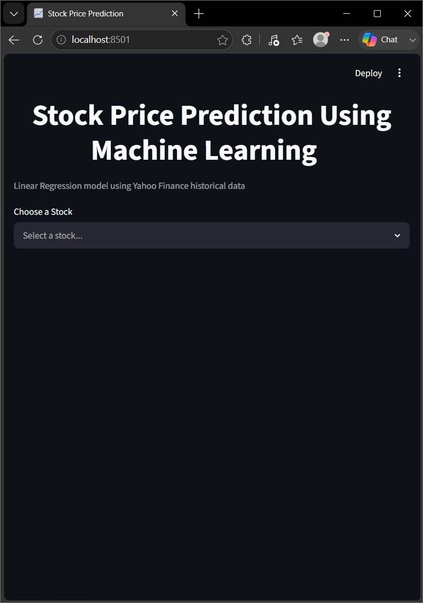
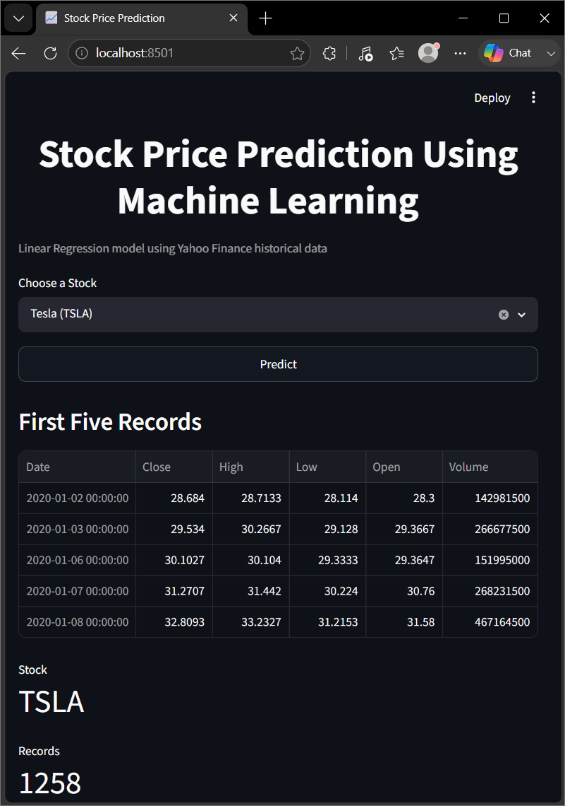
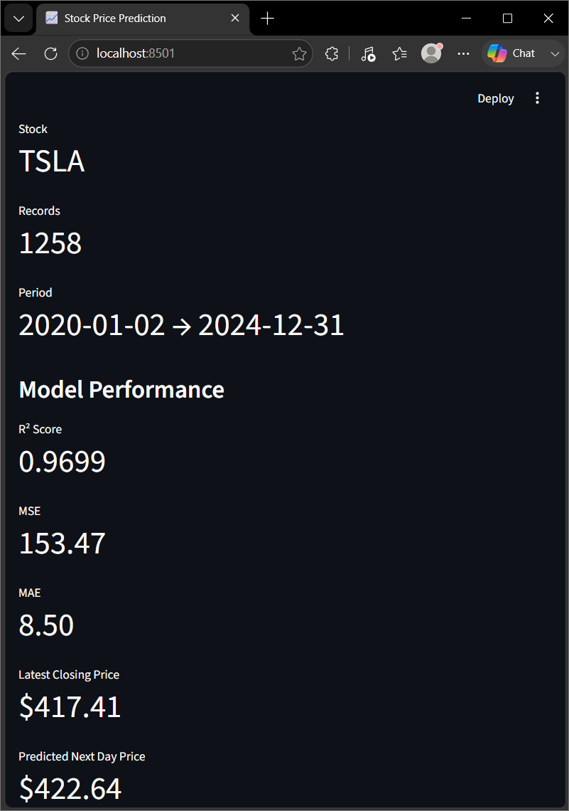
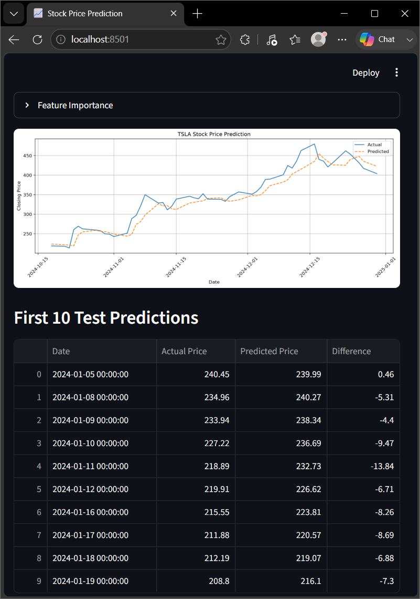
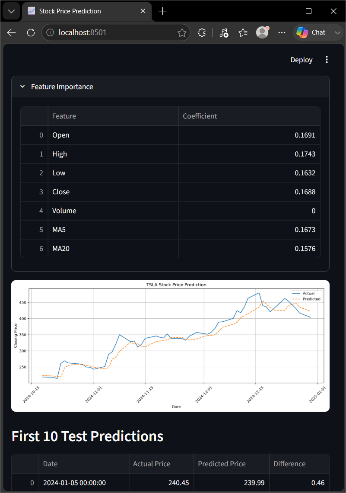
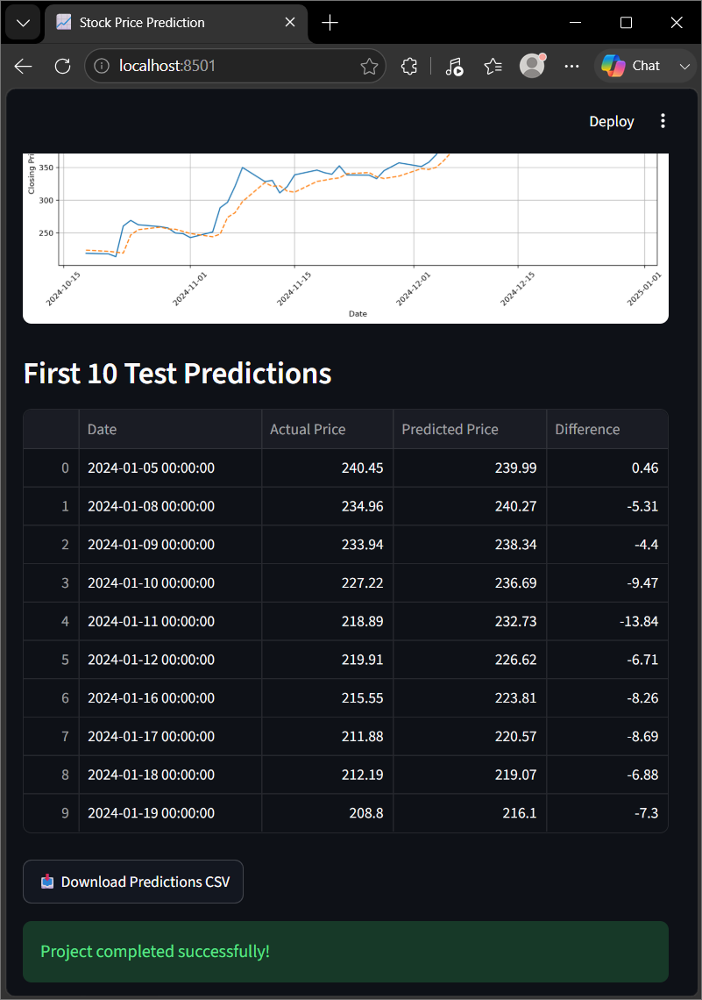

# 📈 Stock Price Prediction Using Machine Learning and Python


A machine learning-based stock forecasting application that predicts the next day's closing price using a **Linear Regression model** trained on historical stock market data.

The project integrates Yahoo Finance data collection, technical feature engineering, supervised learning, model evaluation, and an interactive Streamlit web application for visualization and prediction.

The application provides two execution modes:

- **Streamlit Web Application (`app.py`)**
  - Interactive interface for selecting stocks, training the model, and visualizing predictions.

- **Command-Line Script (`stockprediction.py`)**
  - Terminal-based workflow for training, evaluation, and generating prediction outputs.

---

## 🎥 Demo

The Streamlit web application is demonstrated in two different window layouts.

### Maximized Tab View

Shows the complete application interface in a full browser window.

[▶ View Maximized Tab Demo](demo/maximized-tab.mp4)

### Minimized Tab View

Shows the application running in a smaller browser window.

[▶ View Minimized Tab Demo](demo/minimized-tab.mp4)

---

## 📸 Screenshots

### Application Homepage



### Tesla (TSLA) Prediction Results

The following screenshots show the complete output workflow for a Tesla (TSLA) prediction run, including data processing, model evaluation, and prediction visualization.











---

## Objectives

- Build a machine learning model for stock price prediction
- Collect and preprocess historical stock market data
- Apply technical indicators for feature engineering
- Train a Linear Regression model using supervised learning
- Evaluate prediction performance using regression metrics
- Develop an interactive Streamlit application for stock forecasting
- Visualize actual versus predicted stock prices

---

## Features

- Downloads historical OHLCV stock market data using `yfinance`
- Supports multiple stock tickers including:
  - Apple (AAPL)
  - Microsoft (MSFT)
  - Tesla (TSLA)
- Performs feature engineering using:
  - 5-day Moving Average (MA5)
  - 20-day Moving Average (MA20)
- Predicts next-day closing prices using Linear Regression
- Uses chronological train/test split:
  - 80% training data
  - 20% testing data
- Evaluates model performance using:
  - R² Score
  - Mean Squared Error (MSE)
  - Mean Absolute Error (MAE)
- Visualizes actual vs predicted stock prices
- Saves trained models and prediction outputs
- Provides an interactive Streamlit interface

---

## Dataset

This project uses historical stock market data collected from Yahoo Finance through the `yfinance` library.

Supported stocks include:

- Apple (AAPL)
- Microsoft (MSFT)
- Tesla (TSLA)

The dataset contains historical OHLCV market information:

- Open price
- High price
- Low price
- Closing price
- Trading volume

The closing price is used as the prediction target.

---

## Technologies Used

- **Python** – Programming language
- **Scikit-learn** – Machine learning model development
- **Streamlit** – Interactive web application
- **Yahoo Finance (yfinance)** – Historical stock data
- **Pandas** – Data processing
- **NumPy** – Numerical computing
- **Matplotlib** – Data visualization
- **Joblib** – Model serialization

---

## Machine Learning Workflow

The project follows a complete machine learning pipeline:

1. **Data Collection**
   - Historical stock data is downloaded from Yahoo Finance using `yfinance`.

2. **Feature Engineering**
   - Moving averages are calculated to capture stock price trends:
     - MA5
     - MA20

3. **Data Preparation**
   - Features and target variables are created.
   - Data is split chronologically to prevent future data leakage.

4. **Model Training**
   - A Linear Regression model is trained using historical stock features.

5. **Prediction**
   - The trained model predicts the next day's closing price.

6. **Evaluation**
   - Model performance is measured using regression metrics.

---

## Model Details

This project uses a supervised machine learning approach with Linear Regression.

### Model

**Algorithm:**
- Linear Regression

### Input Features

The model uses engineered stock market features:

- Opening price
- Highest price
- Lowest price
- Trading volume
- MA5 (5-day moving average)
- MA20 (20-day moving average)

### Target Variable

- Next day's closing price

### Training Configuration

- Train/Test Split:
  - 80% Training Data
  - 20% Testing Data

- Evaluation Metrics:
  - R² Score
  - Mean Squared Error (MSE)
  - Mean Absolute Error (MAE)

- Learning Approach:
  - Supervised regression using historical stock features

---

## Repository Structure

```text
.
├── app.py                      # Streamlit web application
├── stockprediction.py          # Command-line prediction script
├── models/                     # Saved trained machine learning models
│   └── stock_prediction_model.pkl
│
├── outputs/                    # Generated prediction results
│   └── predictions.csv
│
├── requirements.txt            # Project dependencies
├── .gitignore                  # Git ignored files
│
├── demo/                       # Application demonstration videos
│   ├── maximized-tab.mp4
│   └── minimized-tab.mp4
│
├── screenshots/                # Application screenshots and outputs
│   ├── homepage.png
│   ├── tesla-prediction-output-01.png
│   ├── tesla-prediction-output-02.png
│   ├── tesla-prediction-output-03.png
│   ├── tesla-prediction-output-04.png
│   └── tesla-prediction-output-05.png
│
└── README.md                   # Project documentation
```

---

## Installation

### 1. Clone the Repository

```bash
git clone https://github.com/ayaronrios/Stock-Price-Prediction-using-Machine-Learning-and-Python.git
cd Stock-Price-Prediction-using-Machine-Learning-and-Python
```

### 2. Create a Virtual Environment (Recommended)

```bash
python -m venv venv
```

Activate the environment:

**macOS/Linux**

```bash
source venv/bin/activate
```

**Windows**

```bash
venv\Scripts\activate
```

### 3. Install Dependencies

```bash
pip install -r requirements.txt
```

If `requirements.txt` has not been populated yet:

```bash
pip install streamlit yfinance pandas matplotlib scikit-learn joblib
```

---

## Usage

### Streamlit Web Application (Recommended)

Launch the interactive interface:

```bash
streamlit run app.py
```

The application allows you to:

* Select a stock ticker
* Download historical data
* Train the model
* View evaluation metrics
* Visualize predictions
* Download prediction results as a CSV file

---

### Command-Line Version

Run:

```bash
python stockprediction.py
```

When prompted, enter a stock ticker such as:

```text
AAPL
```

The script will:

* Download historical data
* Train the model
* Display evaluation metrics
* Plot actual vs. predicted prices
* Save the trained model and predictions

---

## Output Files

After execution, the following files are generated:

| File | Description |
| --- | --- |
| `models/stock_prediction_model.pkl` | Serialized trained Linear Regression model |
| `outputs/predictions.csv` | Actual vs. predicted stock prices for the test dataset |
| `demo/maximized-tab.mp4` | Streamlit application demonstration in maximized browser view |
| `demo/minimized-tab.mp4` | Streamlit application demonstration in minimized browser view |
| `screenshots/` | Application screenshots and Tesla prediction workflow outputs |

Generated artifacts are organized into dedicated directories (`models/` and `outputs/`) to keep the project structure clean and maintainable.

---

## Results

The Linear Regression model successfully learned relationships between historical stock price features and future closing prices.

The model was tested using Tesla (TSLA) historical stock data collected from Yahoo Finance.

### Tesla (TSLA) Prediction Performance

**Dataset Information**

- Stock: Tesla (TSLA)
- Data Period: 2020-01-02 to 2024-12-31
- Total Records: 1,258

### Model Performance

The trained Linear Regression model achieved the following evaluation metrics on the Tesla test case:

- **R² Score:** 0.9699
- **Mean Squared Error (MSE):** 153.47
- **Mean Absolute Error (MAE):** 8.50

### Prediction Example

Using the latest available Tesla closing price from the dataset:

- **Latest Closing Price:** $417.41
- **Predicted Next Day Closing Price:** $422.64

The application generates:

- Actual vs predicted stock price comparisons
- Model evaluation metrics
- Prediction CSV outputs
- Visualization plots

These results demonstrate how traditional machine learning techniques can be applied for financial time-series forecasting using historical market data.

However, stock prices are influenced by many external factors including market sentiment, economic conditions, company news, and unexpected events. Therefore, this model is intended for educational purposes and demonstrates the application of machine learning techniques rather than providing reliable financial predictions.

---

## Roadmap

### Completed

- ✅ Linear Regression stock prediction model
- ✅ Yahoo Finance API integration
- ✅ Historical stock data processing
- ✅ Feature engineering using moving averages (MA5 and MA20)
- ✅ Chronological train/test data split
- ✅ Model evaluation using R² Score, MSE, and MAE
- ✅ Streamlit interactive prediction interface
- ✅ Stock price visualization and CSV export

### Future Improvements

- ⏳ Implement advanced machine learning models:
  - Random Forest
  - XGBoost
  - Gradient Boosting

- ⏳ Add additional technical indicators:
  - RSI (Relative Strength Index)
  - MACD (Moving Average Convergence Divergence)
  - Bollinger Bands

- ⏳ Improve model validation:
  - Walk-forward validation
  - Cross-validation strategies for time-series data

- ⏳ Perform hyperparameter tuning for better model performance

- ⏳ Compare traditional machine learning approaches with deep learning models such as LSTM and GRU
  
- ⏳ Deploy the application to a cloud platform

---

## Disclaimer

This project is developed for educational purposes only. Stock market predictions are based on historical data and should not be considered financial or investment advice.

---

## Author

**Akshaya Karanam**

GitHub: [@ayaronrios](https://github.com/ayaronrios)

---

## Acknowledgments

- Yahoo Finance (`yfinance`) for providing historical market data
- Scikit-learn community for machine learning tools
- Streamlit community for interactive web application development
- Open-source Python data science community

---

## License

This project is licensed under the MIT License.
